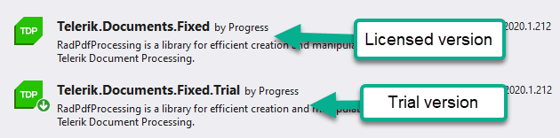

# DocProcessingFunctions
A demo with Telerik Document Processing Libraries in an Azure Function.

## NuGet Packages

This project uses the Telerik NuGet server (via nuget.config) to restore the trial packages. Please visit the following Telerik Document Processing documentation for more detailed information and instructions.

* [Installation: NuGet Packages - Get the Packages](https://docs.telerik.com/devtools/document-processing/getting-started/Installation/nuget-packages#get-the-nuget-packages)

If you have never used the Telerik NuGet server before. Visual Studio will ask you for credentials. Please sign in with the same account that has your trial or dev license.

### Upgrading the References 

The `.Trial` suffix denotes that the package is a trial. To use the dev versions, just install the packages that do not have .Trial in the name.

